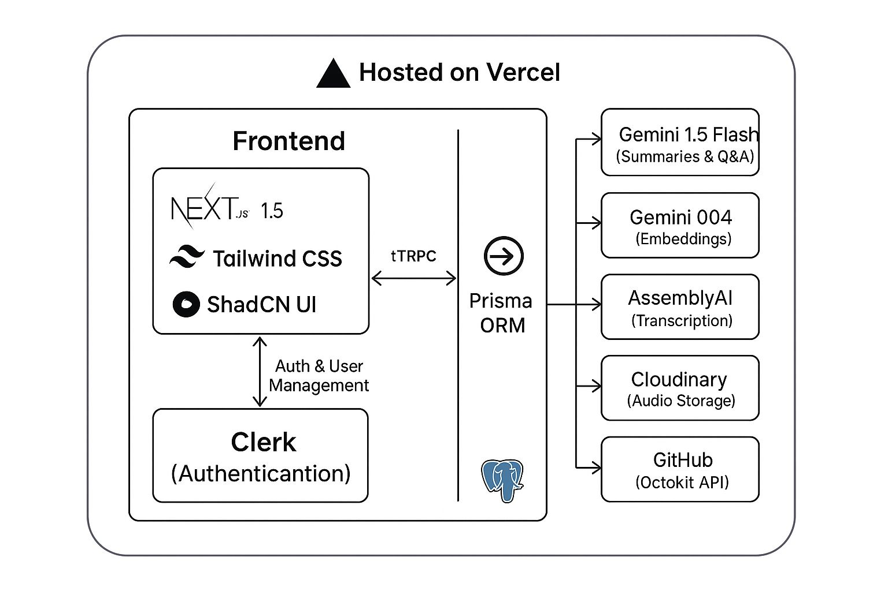
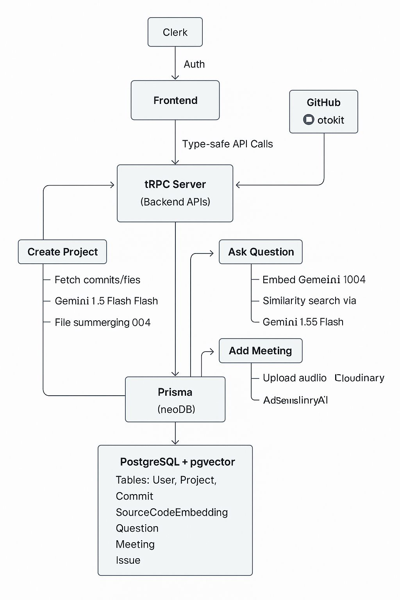

# NeuroHub

NeuroHub is a modern AI-powered platform for codebase intelligence and meeting summarization, enabling users to ask questions about their code, get instant summaries of commits and files, and generate searchable meeting transcriptions—all in a single developer-friendly workspace.

---
## Inspiration 

The idea for **NeuroHub** was born from the daily friction developers face when trying to make sense of large, evolving codebases—especially in collaborative or onboarding-heavy environments. We realized that even with great version control and documentation habits, understanding the “why” and “what” behind code changes, keeping track of important discussions, and finding the right context at the right time is *hard*.  
**NeuroHub** aims to break these barriers by combining code intelligence, AI-powered search, and seamless meeting transcription in a single, developer-first platform.

---

## Features
**NeuroHub** is designed to make your team’s engineering life smoother and more productive:

- **Automatic Commit & File Summaries:** Uses cutting-edge AI (Gemini) to summarize code files and commits so you can get up to speed in seconds.
- **Semantic Codebase Search:** Instantly find code, documentation, or context—thanks to vector embeddings and semantic search.
- **Ask Questions About Your Project:** Just type your question; NeuroHub finds the most relevant code and documentation, then generates an answer with context.
- **Meeting Audio Upload & Summarization:** Upload meeting recordings—get transcripts, extract highlights, and build searchable knowledge automatically.
- **Seamless Collaboration:** All project members can interact, ask questions, and view answers or summaries, keeping the whole team aligned.

--- 
## High-Level Architecture



- **Frontend** (Next.js, ShadCN UI, Tailwind) interacts with users and Clerk (authentication).
- **Backend** (tRPC Server) exposes type-safe APIs, manages all integration logic, and connects to Prisma ORM.
- **Prisma ORM** handles all DB operations (PostgreSQL + pgvector for vector search).
- **External Services:**  
  - **GitHub:** Fetches commits/files for projects.
  - **Gemini:** Summarization (1.5 Flash), Embedding (004), Q&A.
  - **AssemblyAI:** Meeting transcription.
  - **Cloudinary:** Audio file upload/storage.

---

## Key Workflows

<details>
  <summary>Click to view architecture workflow</summary>
  
  
</details>

### 1. Project Creation

- User connects GitHub repo (via frontend)
- Backend fetches commits/files via Octokit
- File summaries: Gemini 1.5 Flash  
- Embeddings: Gemini 004
- Stores summaries and embeddings in DB (via Prisma)

### 2. Q&A

- User asks a question about codebase
- Question embedding generated (Gemini 004)
- Similarity search (pgvector) finds relevant files
- Context fed to Gemini 1.5 Flash for final answer

### 3. Meeting Summarization

- User uploads meeting audio
- Audio stored on Cloudinary
- AssemblyAI transcribes audio
- Gemini generates meeting summary

---

## Challenges

Building NeuroHub wasn’t all smooth sailing!  
Some of our biggest technical and product challenges included:

- Integrating real-time AI summarization into existing code workflows.
- Ensuring semantic code search worked *fast* and *reliably* for real-world, multi-language repos.
- Keeping user data secure while juggling external integrations and file uploads.
- Designing an interface that felt simple—despite a lot of underlying complexity.

---

## Tech Stack

| Layer       | Technology                                      |
|-------------|-------------------------------------------------|
| Frontend    | Next.js 15, Tailwind CSS, ShadCN UI             |
| Auth        | Clerk                                           |
| Backend     | tRPC, Prisma ORM, Vercel                        |
| Database    | PostgreSQL + pgvector                           |
| AI/LLM      | Gemini 1.5 Flash, Gemini 004                    |
| Audio       | Cloudinary (upload), AssemblyAI (transcription) |
| VCS         | GitHub (Octokit API)                            |
| Hosting     | Vercel                                          |

---

## How to run NeuroHub locally

1. **Clone this repo**
    ```sh
    git clone https://github.com/yourusername/neurohub.git
    cd neurohub
    ```
2. **Install dependencies**
    ```sh
    npm install
    # or
    yarn
    ```
3. **Environment variables**
    - Copy `.env.example` to `.env.local` and fill in:
      - Clerk API Key
      - GitHub Token
      - AssemblyAI Key
      - Gemini API Keys
      - Cloudinary Credentials
      - PostgreSQL URL

4. **Run DB migrations**
    ```sh
    npx prisma migrate dev
    ```

5. **Start the app**
    ```sh
    npm run dev
    # or
    yarn dev
    ```

---

## Contact & Contributions

Open issues, submit PRs, and help us build the future of AI-powered developer collaboration!
